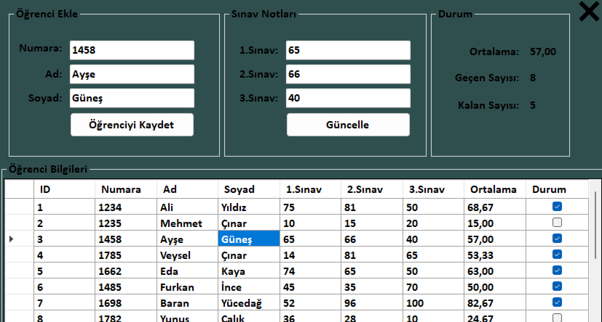
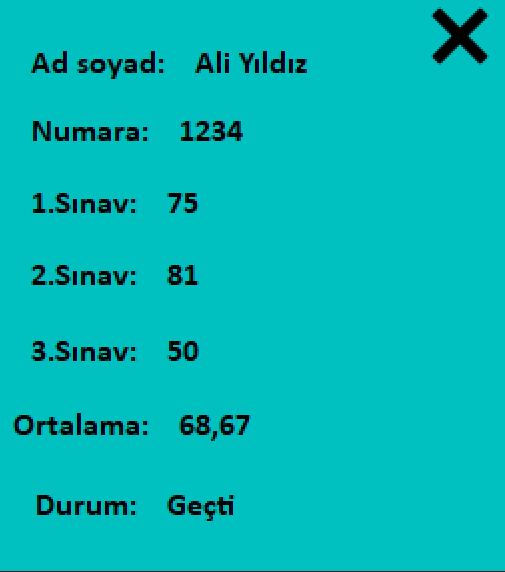

# 📚 E-Okul- C# Windows Forms Project

This is a simple **student information system** developed using **C# and Windows Forms**, inspired by the "E-Okul" system. It allows teachers to manage student grades and students to view their academic performance through a user-friendly desktop interface.

## 📸 Images

## 🚀 Features

- 👨‍🏫 **Teacher Panel**
  - Login with credentials
  - View student list
  - Add or update grades

- 🎓 **Student Panel**
  - Login with credentials
  - View grades by subject

- 🔒 Secure login screens for students and teachers
- 💾 SQL Server database integration
- 📊 Display of data using `DataGridView`
- ✍️ Full CRUD support for grade records

## 🛠️ Technologies Used

- C# (.NET Framework)
- Windows Forms
- SQL Server (with ADO.NET)
- Visual Studio
